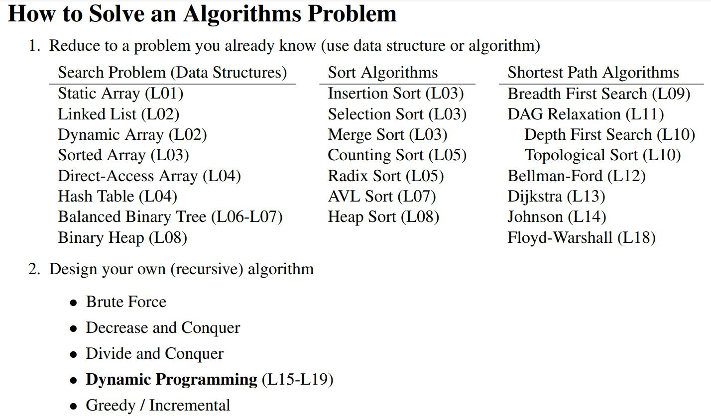
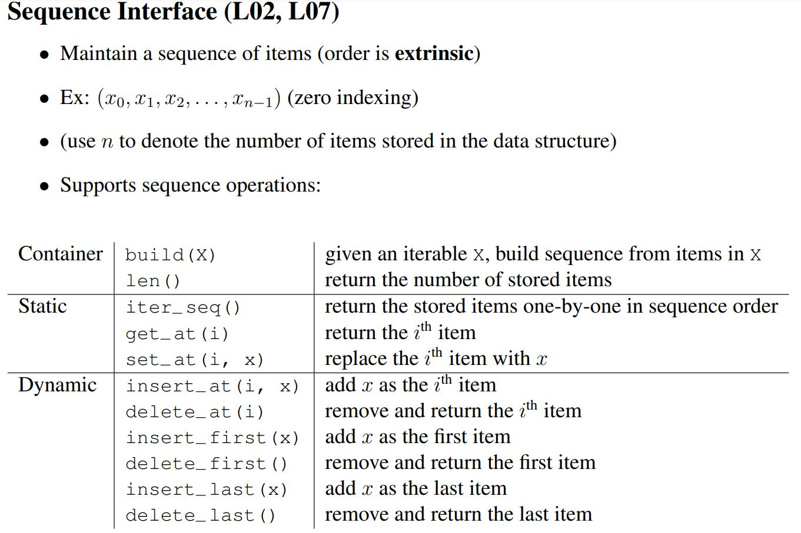
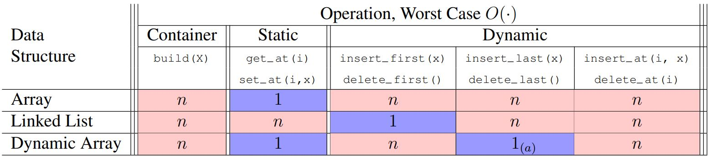
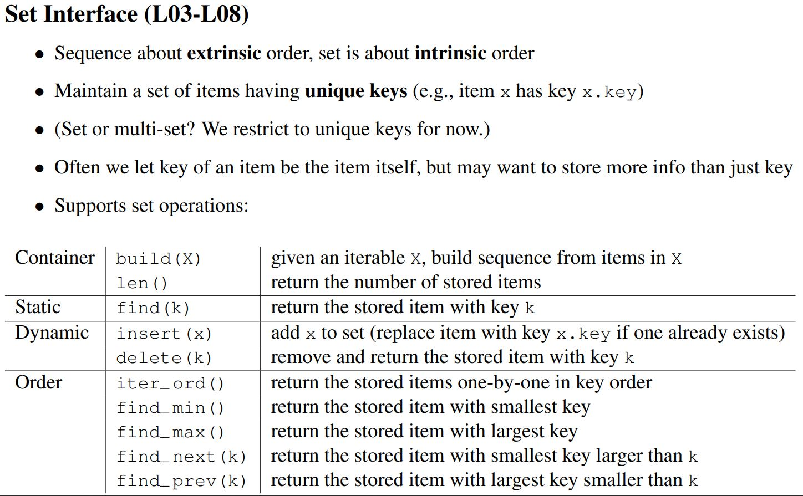
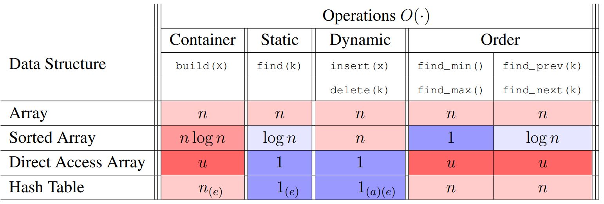

# About

This repository is about The implementation of algorithms and data structures in MIT 6.006 course. The programming language used is `C++14`. There's a `Makefile` in each folder to build the tests using `GNU GCC compiler` and `Make` utility.

# How to solve an algorithms problem

# Sequence ADT

# Set ADT

